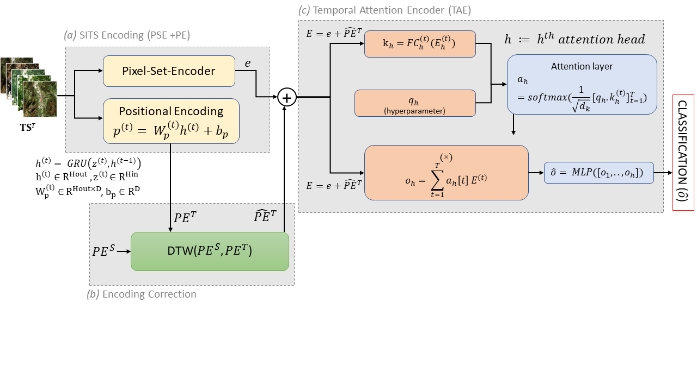

# TOWARDS EXPLAINABLE AI4EO:
## AN EXPLAINABLE DEEP LEARNING APPROACH FOR CROP TYPE MAPPING USING SATELLITE IMAGES TIME SERIES



## Abstract
---
Deep Learning (DL) models are extremely effective for crop-type mapping. However, they generalize poorly when there is a temporal shift between the Satellite Image Time Series
(SITS) acquired in the source domain (where the model is trained) and the target domain (never seen by the network). To address this challenge, this paper proposes an Explainable
Artificial Intelligence (xAI) approach that leverages the interpretability of the inner workings of transformer encoders to automatically capture and mitigate the temporal shift be-
tween SITS acquired in different regions. The Positional Encoding (PE) output computed on the source SITS is used as a proxy to quantify the temporal shift with respect to the PE
output obtained on the target SITS. This condition allows us to re-align the latter to the representation that the model natively adopts to discriminate crop types through a Dynamic
Time Warping (DTW) approach. Compared to the baseline architecture, the proposed method increases the Overall Accuracy (OA) up to 8% on the TimeMatch benchmark dataset.

## Installation
---

1. Clone the repository
2. Setup a new conda environment and activate it
```
conda env create -f environment.yml
conda activate xai4eo
```
3. Download the [Timematch dataset](https://zenodo.org/record/5636422) and extract it to `../data/timematch_data` (or set `--data_root` to its path for `train.py`). The extrated size is about 78 GB.


## Replicate experiments
---
Pre-trained models and pre-computed positional encodings are available in `./outputs`.

Reproduce the results by running the provided script :
```
chmod +x ./scripts/run_dtw_experiments.sh
./scripts/run_dtw_experiments.sh
```

Positional Encoding illustrations can be generated using the `dtw/PE_illustrations.ipynb` notebook.

## Credits
---
This repository is based on the original [Thermal Positional Encoding code ](https://github.com/jnyborg/tpe) which builds upon the [TimeMatch code](https://github.com/jnyborg/timematch) and the official implementation of the [PSE+LTAE](https://github.com/VSainteuf/lightweight-temporal-attention-pytorch).
